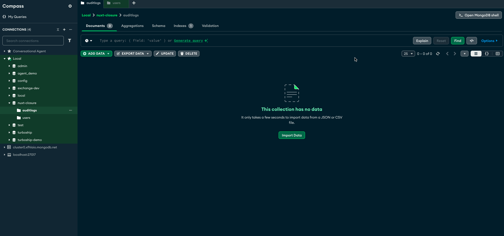

# System Design - Auditing module using middlewares, hooks on events, closures & more.



## Setup

- Create `./.env` and add the following.

  ```sh
  AUTH_TOKEN_SECRET="MySecret"
  AUTH_TOKEN_EXPIRES_IN="3650 days"
  MONGODB_URI="mongodb://localhost:27017/nuxt-closure"
  ```

- `npm install`
- `npm run dev`

## Dive Deeper

[Read more](https://loi-tran-blog.netlify.app/blog/system-design-auditing) on my blog.
